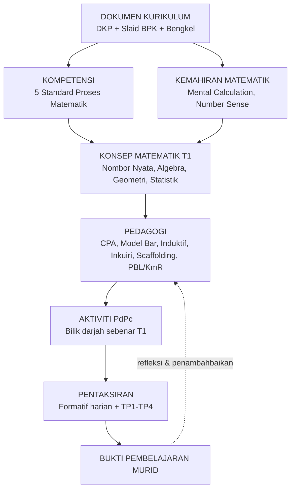

# 00 — Peta Knowledge Base: Matematik Tingkatan 1 KP2027

> Fail ini ialah "peta navigasi" — mulakan di sini sebelum ke fail lain.
> Label sumber: **[DOKUMEN]** = DKP/BPK/Bengkel · **[KAJIAN]** = penyelidikan luar · **[INTERPRETASI]** = sintesis pembangun KB · **[CADANGAN AMALAN]** = idea pelaksanaan.

---

## 1. Hierarki Sumber (wajib dipatuhi di semua fail)

**DKP → Slaid BPK → Analisis Rakaman Bengkel → Kajian Luar**

Kajian luar (Fasa 3) **tidak pernah menggantikan** maksud DKP — ia hanya menerangkan *kenapa* dan *bagaimana* sesuatu perkara dalam DKP berkesan, disokong bukti antarabangsa. [INTERPRETASI]

---

## 2. Rangka Hubungan Konsep

---

## 3. Indeks Fail

| Fail | Konsep Utama | Kelompok |
|---|---|---|
| `01_pengenalan_dokumen.md` | Konteks DKP/BPK/Bengkel, hierarki sumber | Asas |
| `02_kompetensi_matematik.md` | 5 Standard Proses, Fikrah, Competency-Oriented | Kompetensi |
| `03_kemahiran_matematik.md` | Mental Calculation, Number Sense, Hukum Aritmetik | Kemahiran |
| `04_pedagogi_dan_pdpc.md` | Scaffolding, Pembelajaran Terbeza, Gamifikasi, Unlearn&Relearn | Pedagogi |
| `05_cpa_dan_model_bar.md` | CPA Approach, Model Bar | Pedagogi/Representasi |
| `06_pendekatan_induktif_dan_inkuiri.md` | Pendekatan Induktif, Inkuiri Statistik 5 Langkah | Pedagogi |
| `07_penyelesaian_masalah_dan_heuristik.md` | Heuristik, Polya | Penyelesaian Masalah |
| `08_penaakulan_dan_komunikasi.md` | Penaakulan, Komunikasi, Verification | Penaakulan/Komunikasi |
| `09_perwakilan_matematik.md` | Representasi, Van Hiele, Gambar Rajah Venn | Representasi |
| `10_pemikiran_algebra.md` | Ungkapan Algebra, Pemboleh Ubah | Pemikiran Algebra |
| `11_pbl_dan_kmr.md` | PBL, KmR | Pentaksiran/Pedagogi |
| `12_pentaksiran_dan_tp.md` | TP1–TP4 (Model Miller), Formatif vs SPi | Pentaksiran |
| `13_miskonsepsi_dan_kesilapan.md` | Kesilapan lazim merentas topik | Miskonsepsi |
| `14_glosari_istilah.md` | Glosari BM/BI | Navigasi |
| `15_bacaan_lanjutan.md` | Senarai rujukan kajian luar | Rujukan |

---

## 4. Cara Guna Knowledge Base Ini

1. Jumpa istilah dalam DKP/buku teks/RPT → semak `14_glosari_istilah.md` → ia rujuk ke fail konsep berkaitan.
2. Baca fail konsep — setiap fail berdiri sendiri (definisi, teori, kajian, contoh T1, aktiviti, refleksi).
3. Guna `13_miskonsepsi_dan_kesilapan.md` semasa merancang RPH untuk elak jangkaan salah biasa.
4. Guna `15_bacaan_lanjutan.md` jika perlu rujukan penuh untuk LADAP/pembentangan/penulisan.

> **Amaran kekal:** [DOKUMEN] ialah autoriti muktamad. Jika kajian luar [KAJIAN] nampak bercanggah dengan DKP, DKP diguna pakai; percanggahan tersebut hanya dicatat sebagai nota perbandingan, bukan pindaan kepada arahan rasmi.
